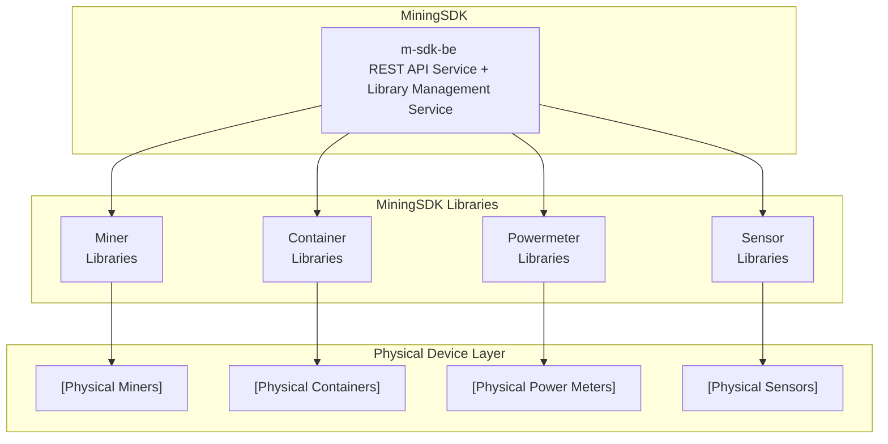

# MiningSDK — Architecture

---

## 1. Purpose

This document describes the internal architecture of **MiningSDK** — the backend SDK powering Bitcoin mining operations across all scales.

MiningSDK is designed to:
- Run **as a single process** or **as distributed microservices**
- Support **multiple device types** 
- Scale from **one miner to thousands** without architectural changes

---

## 2. Architectural Principles

MiningSDK is built on the following core principles:

### 2.1 Separation of Concerns
- Device logic is isolated from runtime and deployment
- Communication, storage, and scheduling are standardized

### 2.2 Deployment Independence
- The same codebase supports local, PM2, Docker, and Kubernetes deployments
- Scaling decisions are configuration-driven, not code-driven

### 2.3 Modularity
- Each device type is implemented as an independent module
- New functionality is added without modifying the core runtime


---

## 3. High-Level Architecture

MiningSDK follows a **modular architecture**.




At runtime, the SDK loads and orchestrates:
- Device workers
- Internal services
- Communication adapters
- Persistent storage

---

## 4. Core Components

### 4.1 Runtime

The **runtime** is the execution environment that:
- Loads configuration
- Initializes services
- Manages worker lifecycles
- Handles startup, shutdown, and recovery

Responsibilities:
- Dependency injection
- Process lifecycle management
- Error isolation
- Graceful shutdowns

---

### 4.2 Workers

Workers are the **primary execution units** in MiningSDK.

Each worker:
- Implements a single responsibility
- Communicates via standardized RPC interfaces
- Can run in-process or as an independent service

Examples:
- Miner workers
- Container workers
- Power meter workers
- Aggregation workers


---

### 4.3 Device Modules

Device modules define **how to communicate with a specific device type**.

Characteristics:
- Brand and model specific
- Stateless where possible
- Reusable across deployment modes

Example structure:\
types \
├─ m30sp.miner.lib.js\
├─ m53s.miner.lib.js\
└─ m56s.miner.lib.js


---

## 5. Communication Model

MiningSDK uses a **uniform RPC-based communication layer**.

### 5.1 RPC Abstraction

- Workers expose typed RPC methods
- Calls work identically in-process mode
- Transport is abstracted from the caller

---

### 5.2 Message Flow
Client → API Layer → Worker RPC → Device


This abstraction allows:
- Transparent scaling
- Service isolation
- Minimal latency in single-process mode

---

## 6. Deployment Models

MiningSDK supports multiple deployment strategies without code changes.

### 6.1 Single-Process Mode

Best for:
- Development
- Home miners
- Small sites

| Single Node                        |
| ---------------------------------- |
| Runtime                            |
| Device Libraries (in-process)      |
| Storage                            |


Benefits:
- Minimal resource usage
- Simple debugging
- No orchestration overhead

---

### 6.2 Microservices Mode

Best for:
- Large sites
- High availability environments


Benefits:
- Independent scaling
- Fault isolation
- Rolling updates

---

## 7. Storage Architecture

MiningSDK provides **persistent, local-first storage**.

### 7.1 Hyperbee Storage

- Embedded key-value store
- Optimized for time-series data
- Supports replication

Use cases:
- Metrics history
- Device state
- Configuration snapshots
- Event logs

---

### 7.2 Data Flow


Storage is:
- Append-only
- Crash-resilient
- Consistent across restarts

---

## 8. Configuration Model

Configuration is **explicit and declarative**.

- Environment variables define deployment mode
- Worker configuration is independent of runtime
- No hard-coded assumptions

Example: miningsdk.config.json
```yaml
{
  "mode": "microservices",
  "runtime": "pm2", // "pm2" | "docker"
  "services": [
    {
      "name": "api-gateway",
      "port": 3000
    },
    {
      "name": "wm-m56s",
      "lib": "miner-whatsminer",
      "deviceType": "M56S"
    },
    {
      "name": "am-s19xp",
      "lib": "miner-antminer",
      "deviceType": "S19XP"
    }
  ]
}
```

## 9. Failure Handling

MiningSDK is designed to fail **locally and predictably**.

- Worker crashes do not bring down the runtime
- Automatic worker restarts
- Health checks and liveness probes

### Microservices Mode

In distributed deployments:

- Supervisors such as **PM2**, **Docker**, or **Kubernetes** handle restarts
- Workers automatically rejoin the system after recovery

---

## 10. Security Model

MiningSDK follows a strict security-by-design approach:

- Explicit interfaces only
- No implicit network exposure
- Authenticated RPC calls
- Least-privilege permissions for all workers

---

## 11. Extensibility

MiningSDK is **extensible by design**.

You can add:

- New device types
- New storage backends
- New communication transports
- Custom orchestration logic

All extensions can be introduced **without modifying the core runtime**.

---

## 12. Summary

MiningSDK provides:

- A unified backend architecture
- Flexible deployment models
- Strong isolation and scalability
- Long-term maintainability

MiningSDK is a **backend SDK** designed to evolve alongside the Bitcoin mining ecosystem.
