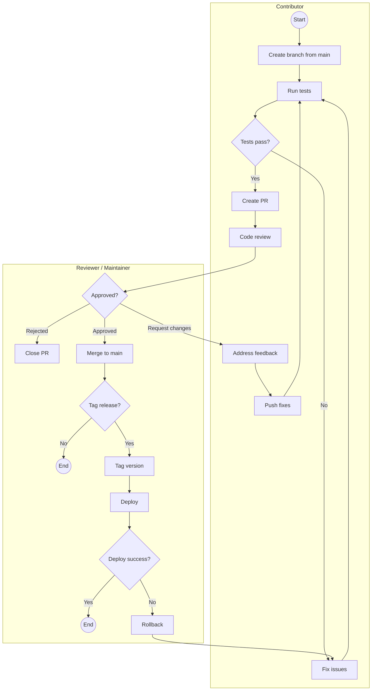

# Contributing to MiningSDK

Thank you for your interest in contributing to **MiningSDK**! 

This document outlines the contribution workflow for all MiningSDK repositories, from setting up your development environment to submitting pull requests and participating in releases.

---

## Getting Started

### Prerequisites

Before contributing, make sure you have the following installed:

- **Node.js** (version 20.0 or higher)
- **Git** (latest stable version)
- **npm** (included with Node.js)

---

### Licensing

MiningSDK is released under the **Apache License 2.0**.

By contributing, you agree that:

- You retain copyright over your contributions
- You grant a perpetual, worldwide, royalty-free license for their use
- Contributions are provided **“AS IS”**, without warranty

For full details, see the [Apache License 2.0](https://www.apache.org/licenses/LICENSE-2.0.html).

---

## Development Environment Setup

### Fork and Clone

1. Fork the repository on GitHub.
2. Clone your fork locally and navigate into the project directory:

   ```bash
   git clone https://github.com/YOUR_USERNAME/REPOSITORY_NAME.git
   cd REPOSITORY_NAME
   ```

3. Add the upstream remote to keep your fork in sync with the main repository:

   ```bash
   git remote add upstream https://github.com/tetherto/REPOSITORY_NAME.git
   ```

> Replace `REPOSITORY_NAME` with the actual repository name.

---

## Pull Request Workflow

### Branch Naming Convention

Create branches using the following pattern:

```
{type}/{short-description}
```

Supported types:

- `feature/` — New features or workers
- `fix/` — Bug fixes
- `docs/` — Documentation changes
- `refactor/` — Code refactoring
- `test/` — Test additions or changes

#### Examples

```bash
# New feature
git checkout -b feature/miningsdk-new-device

# Bug fix
git checkout -b fix/timeout-handling
```

---

### Keeping Your Fork Updated

Regularly sync your fork with the upstream repository:

```bash
git fetch upstream
git checkout main
git merge upstream/main
git push origin main
```

---

### Pull Request Steps

1. Create a branch from `main`
2. Make your code changes
3. Write or update tests
4. Run linting and tests locally
5. Commit changes with meaningful messages
6. Push your branch and open a Pull Request targeting `main`

---

### PR Checklist

Before submitting your PR, ensure that:

- [ ] Code builds locally
- [ ] Tests pass (`npm test`)
- [ ] Linting passes (`npm run lint` or `npm run lint:fix`)
- [ ] New features include tests
- [ ] Documentation is updated if applicable

---

### PR Title Format

Use the following convention:

```
{type}({scope}): {description}
```

Types:

- `feat`
- `fix`
- `docs`
- `refactor`
- `test`
- `chore`

Examples:

- `feat(miner): add Antminer S21 support`
- `fix(timeout): resolve action timeout handling`
- `docs(api): update stats documentation`

---

## Release Process

### PR Review

All pull requests go through the following review steps:

1. **Automated Checks** — Linting and tests must pass
2. **Code Review** — At least one maintainer approval is required
3. **Feedback Resolution** — All requested changes must be addressed
4. **Squash and Merge** — Maintainers squash commits to keep history clean

---

### Release Workflow

Releases are created by merging approved branches into `main` and tagging a version when applicable.

**Workflow:**

1. Contributor creates a feature or fix branch from `main`
2. Contributor runs tests locally
3. If tests fail, fixes are applied and tests re-run
4. Contributor opens a PR targeting `main`
5. Reviewer performs code review
6. Contributor addresses feedback (if requested)
7. Reviewer approves or rejects the PR
8. Approved PRs are merged into `main`
9. Reviewer tags a release version (if applicable)
10. Reviewer deploys to production
11. On failure, rollback to the previous tag

---

### Workflow Diagram



---

## Versioning and Tagging

### Version Tagging

```bash
git checkout main
git pull origin main

git tag -a v1.2.0 -m "Release v1.2.0: Add RTD support"

git push origin main
git push origin v1.2.0
```

### Versioning Scheme

MiningSDK follows **Semantic Versioning**:

- **MAJOR** (`1.x.x`) — Breaking changes
- **MINOR** (`x.1.x`) — New backward-compatible features
- **PATCH** (`x.x.1`) — Backward-compatible bug fixes

---

## Code Standards

### JavaScript Style

MiningSDK uses **StandardJS** style to keep the codebase consistent and easy to review across repositories.

Key rules:

- 2-space indentation
- No semicolons
- Single quotes for strings
- Space after keywords (`if`, `for`, `while`)
- No unused variables

---

## Quick Reference

### Common Git Commands

```bash
# Start a new feature
git checkout main && git pull && git checkout -b feature/my-feature

# Sync with upstream
git fetch upstream && git merge upstream/main

# Prepare for PR
npm run lint:fix && npm test

# Squash commits
git rebase -i HEAD~N

# Amend last commit
git commit --amend

# Force push after rebase (feature branches only)
git push --force-with-lease origin feature/my-feature
```

---

Happy contributing, and thanks for helping improve MiningSDK! 🚀

